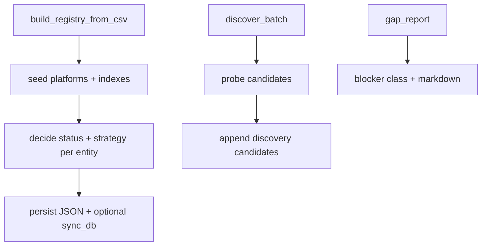

# Flowcharts — `source_registry`

> 🟢 2026-07-28 | HEAD `ffbb9608`

```mermaid
flowchart TD
  A[build_registry_from_csv] --> B[seed platforms + indexes]
  B --> C[decide status + strategy per entity]
  C --> D[persist JSON + optional sync_db]
  E[discover_batch] --> F[probe candidates]
  F --> G[append discovery candidates]
  H[gap_report] --> I[blocker class + markdown]
```
