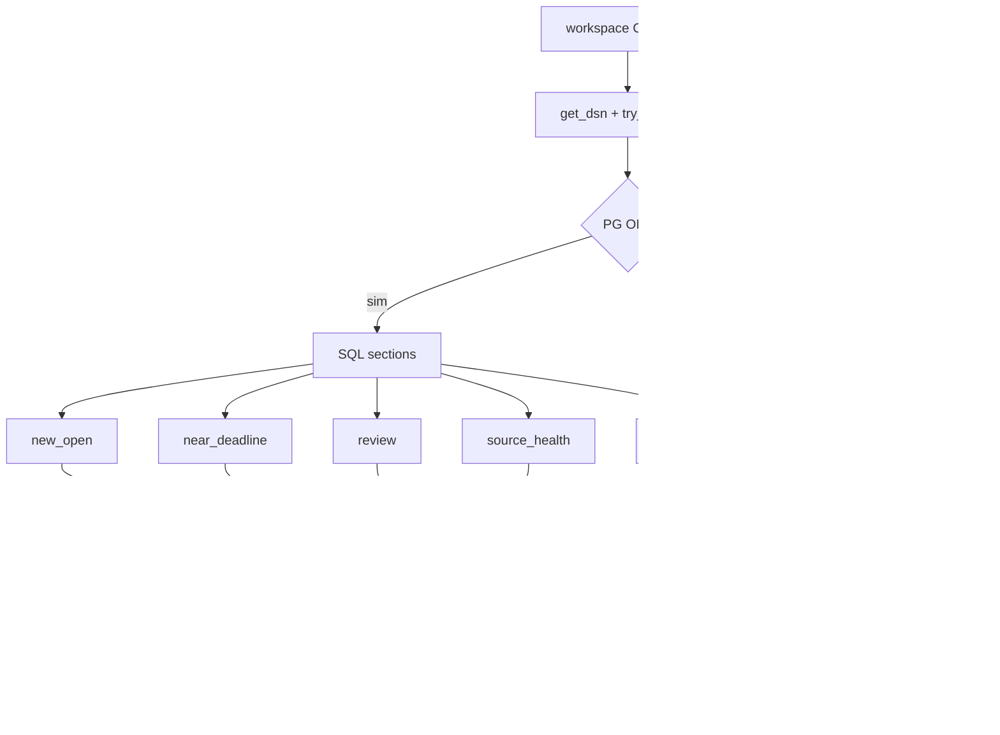
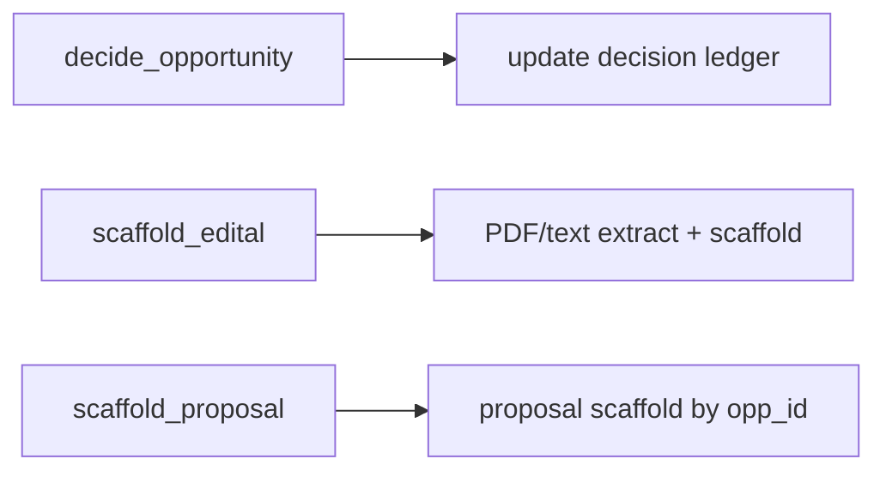

# Flowcharts — módulo `workspace`

> 🟢 CONFIRMADO — 2026-07-17

## 1. Fila do dia (`build_today`)

```mermaid
flowchart TD
    A[workspace CLI today] --> B[get_dsn + try_pg_conn]
    B --> C{PG OK?}
    C -->|sim| D[SQL sections]
    C -->|não| E[session JSON offline]
    D --> F[new_open]
    D --> G[near_deadline]
    D --> H[review]
    D --> I[source_health]
    D --> J[expiring]
    E --> K[load_session_opportunities]
    F --> L[SectionResults]
    G --> L
    H --> L
    I --> L
    J --> L
    K --> L
    L --> M[suggested_actions]
    M --> N[emit table/json]
```

## 2. Actions

```mermaid
flowchart LR
    A[decide_opportunity] --> B[update decision ledger]
    C[scaffold_edital] --> D[PDF/text extract + scaffold]
    E[scaffold_proposal] --> F[proposal scaffold by opp_id]
```
