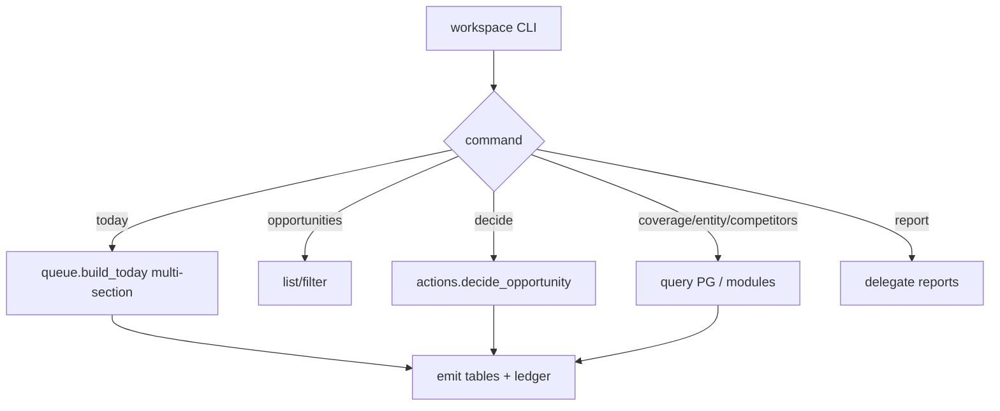

# Flowcharts — `workspace`

> 🟢 2026-07-28 | HEAD `ffbb9608`

```mermaid
flowchart TD
  A[workspace CLI] --> B{command}
  B -->|today| C[queue.build_today multi-section]
  B -->|opportunities| D[list/filter]
  B -->|decide| E[actions.decide_opportunity]
  B -->|coverage/entity/competitors| F[query PG / modules]
  B -->|report| G[delegate reports]
  C --> H[emit tables + ledger]
  E --> H
  F --> H
```
