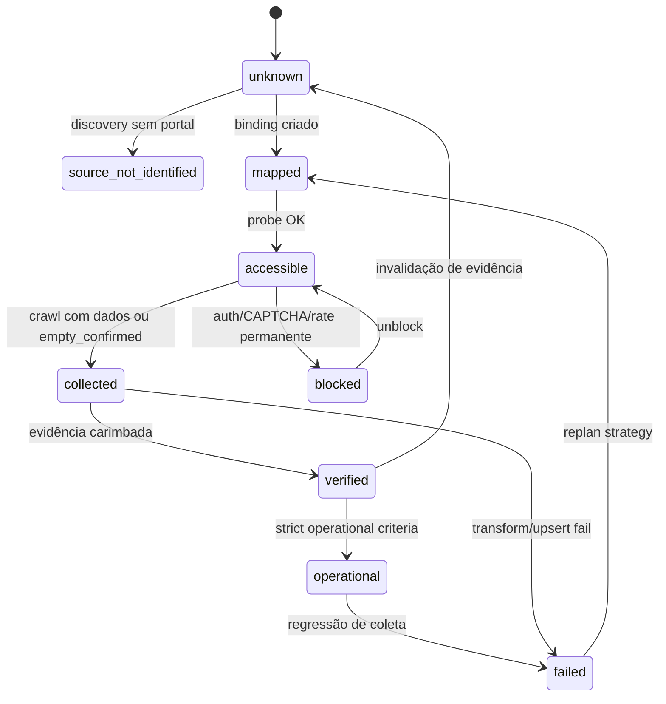
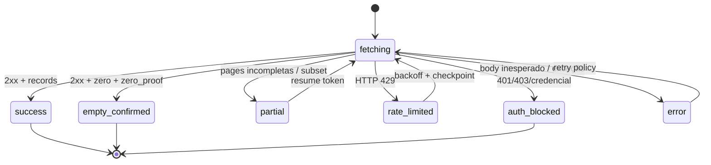
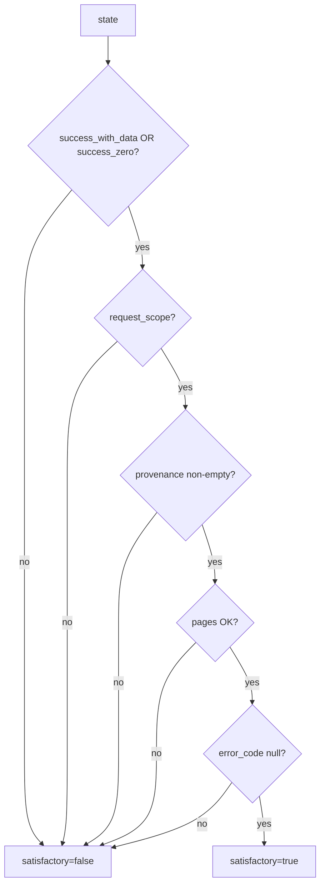
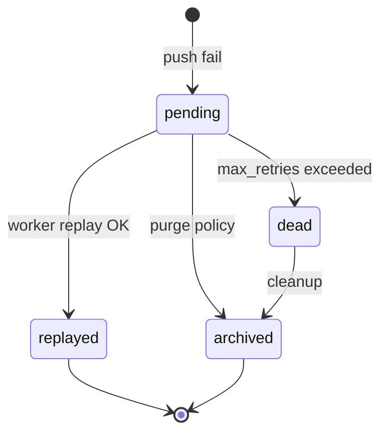
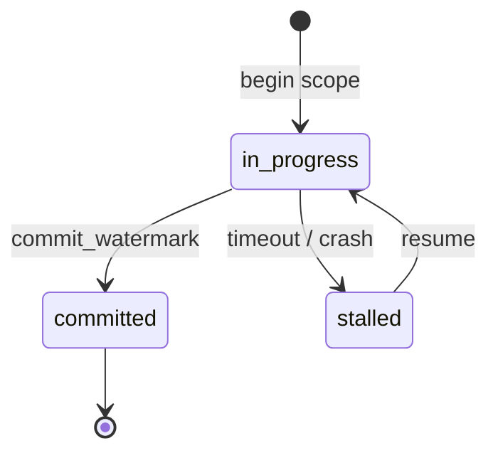
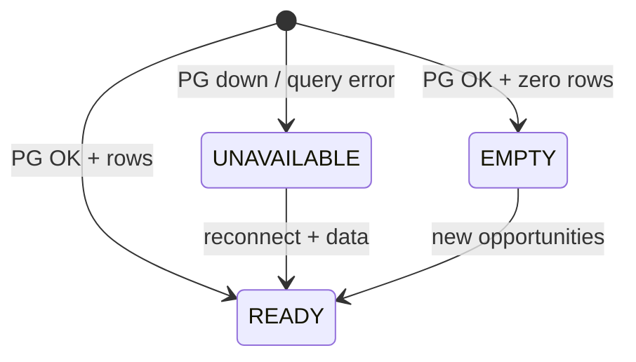
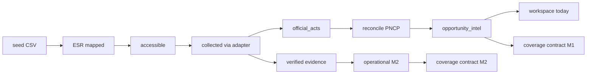

# Máquinas de Estado — Extra Consultoria

> Re-extração Detective 2026-07-17 | HEAD `d3e82ba`  
> Mantém MS1–MS10 (2026-07-13) e adiciona MS11–MS16 do delta B2G

---

## MS1–MS10 (resumo — ver histórico 2026-07-13)

| ID | Entidade | Campo / conceito |
|----|----------|------------------|
| MS1 | Edital intel | status_temporal (PLANEJAVEL…EXPIRADO) |
| MS2 | ingestion_runs | status running/completed/failed |
| MS3 | entity match | match_method cascade |
| MS4 | opportunity status | open/terminal/review (QW-01) |
| MS5 | bid recommendation | GO/REVIEW/NO_GO triage |
| MS6 | soft-delete | is_active + purge |
| MS7 | evidence_state | coverage_evidence states |
| MS8 | QW-01 Radar pipeline | stages crawl→score→export |
| MS9 | Readiness Gate | pass/fail-closed |
| MS10 | Freshness Gate | fresh/stale fail-closed |

Detalhes Mermaid completos das MS1–MS10 permanecem válidos; abaixo o delta crítico.

---

## MS11: Access status do Entity Source Registry 🟢

**Entidade:** `entity_source_registry.access_status`  
**Fonte:** migration 053, `source_registry/models.py`

| De | Para | Gatilho |
|----|------|---------|
| * | mapped | build_registry / discovery grava binding |
| mapped | accessible | probe_url sucesso |
| accessible | collected | adapter success/empty_confirmed |
| collected | verified | evidence ledger seal + stages |
| verified | operational | `is_strict_operational` true |
| * | blocked | auth_blocked / blocker class |
| * | failed | error sem recovery |

---

## MS12: FetchResult do Adapter (ADR-021) 🟢

**Entidade:** resultado de `SourceAdapter.fetch`  
**Campo:** `status`

**Regra:** apenas `success` e `empty_confirmed` podem alimentar `satisfactory=true` (com demais predicados mig 054).

---

## MS13: CoverageEvidence satisfactory 🟢

**Entidade:** `coverage_evidence`  
**Campo:** `satisfactory` (boolean derivado/guardado)

---

## MS14: DLQ entry lifecycle 🟢

**Entidade:** `dlq_entries.status`

---

## MS15: Pipeline watermark 🟢

**Entidade:** `pipeline_watermarks.status`

---

## MS16: Workspace section availability 🟢

**Entidade:** seção da fila `today`  
**Estados lógicos:** READY | EMPTY | UNAVAILABLE

🟢 CONFIRMADO — ADR-017, `workspace/queue.py` (fallback session JSON).

---

## MS7 (detalhe atualizado): evidence / coverage states 🟢

Integra map_monitor_state_to_evidence + evaluate_freshness:

| Monitor status | Evidence state típico |
|----------------|----------------------|
| success + records | success_with_data |
| success zero + zero_proof | success_zero |
| partial pages | partial |
| 429 | rate_limited / error path |
| exception | error |

Freshness: estado operacional pode degradar para stale se `now - checked_at > freshness_sla_hours`.

---

## Diagrama transversal — jornada entidade 1093

