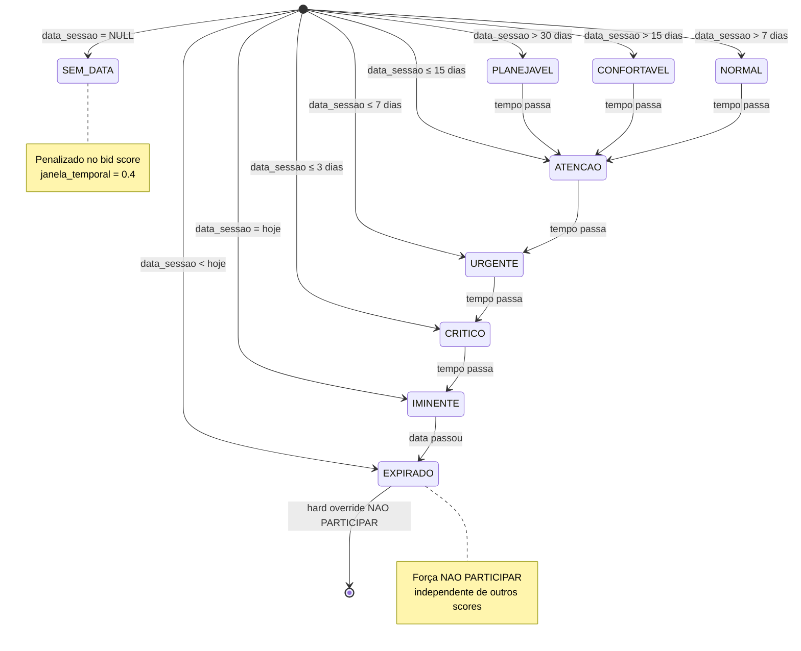
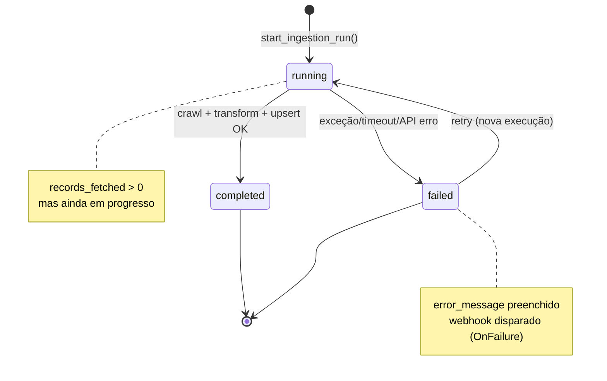
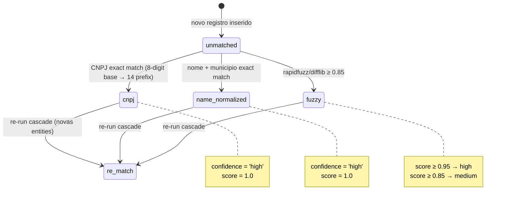
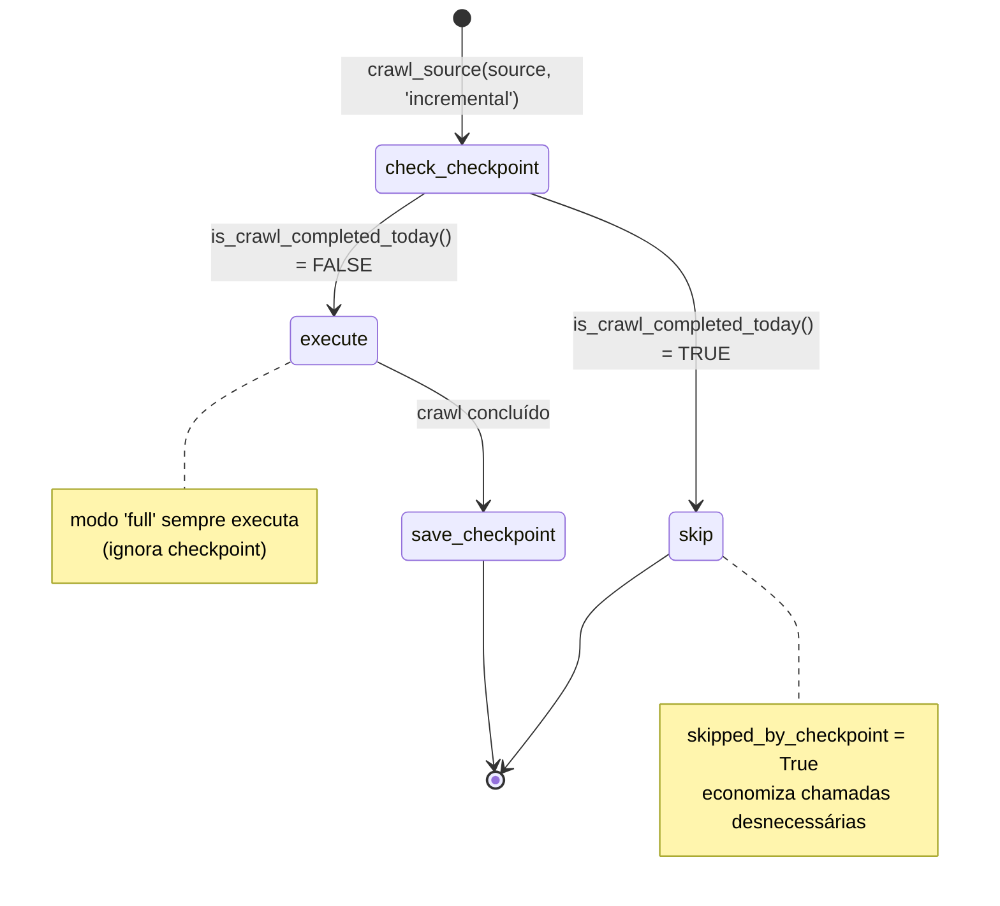
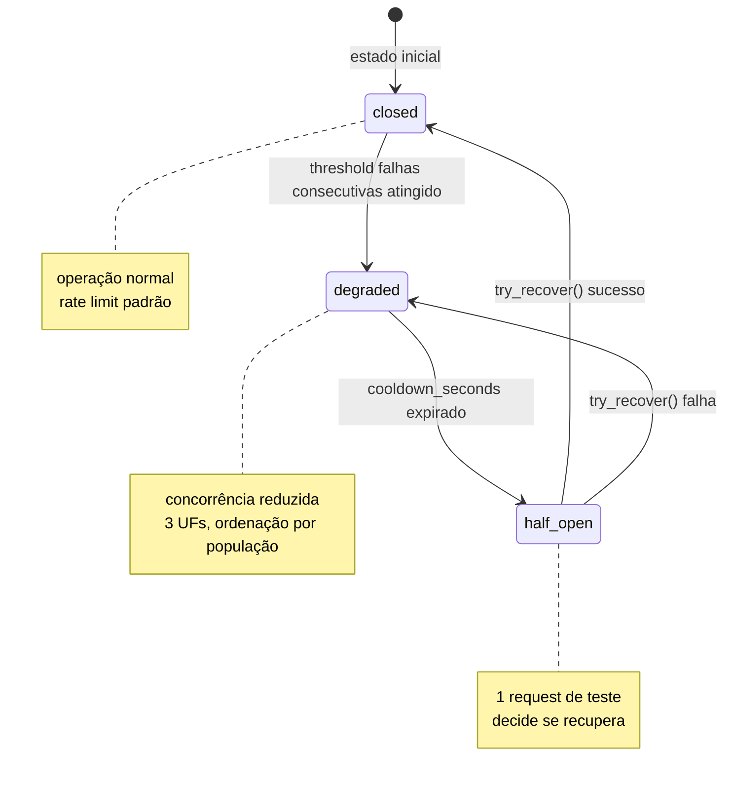
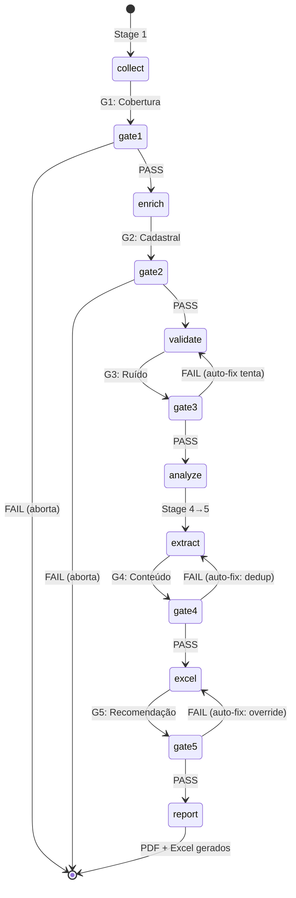

# Máquinas de Estado — Extra Consultoria

> Gerado pelo Detective em 2026-07-11T21:30:00Z
> doc_level: completo
> Base: commit e9729e1

---

## MS1: Status Temporal do Edital

**Entidade:** Edital (pipeline Intel) | **Campo:** `status_temporal`

🟢 CONFIRMADO — `intel-analyze.py:_compute_urgency()`, `intel_pipeline.py:gate5_recomendacao()`.

**Transições e gatilhos:**

| De | Para | Gatilho | Efeito no Score |
|----|------|---------|-----------------|
| Qualquer | EXPIRADO | `data_sessao < hoje` | Força NAO PARTICIPAR |
| Qualquer | IMINENTE | `data_sessao = hoje` | janela_temporal = 0.6 |
| Qualquer | CRITICO | `dias_restantes ≤ 3` | janela_temporal = 0.3 |
| Qualquer | URGENTE | `dias_restantes ≤ 7` | janela_temporal = 0.3 |
| Qualquer | ATENCAO | `dias_restantes ≤ 15` | janela_temporal = 0.5 |
| Qualquer | NORMAL | `dias_restantes ≤ 30` | janela_temporal = 0.8 |
| Qualquer | CONFORTAVEL | `dias_restantes > 30` | janela_temporal = 1.0 |
| Qualquer | PLANEJAVEL | `dias_restantes > 30` | janela_temporal = 1.0 |
| — | SEM_DATA | `data_sessao IS NULL` | janela_temporal = 0.4 |

---

## MS2: Status de Execução de Crawl (Ingestion Run)

**Entidade:** `ingestion_runs` | **Campo:** `status`

🟢 CONFIRMADO — `orchestrator.py:_start_ingestion_run()`, `_finish_ingestion_run()`.

---

## MS3: Estado de Match de Entidade

**Entidade:** `pncp_raw_bids` | **Campo:** `match_method`

🟢 CONFIRMADO — `entity_matcher.py:match_entities_cascade()`.

**Estados possíveis de `match_confidence`:** `high`, `medium`, `low` (declarado mas nunca atribuído — fuzzy com score ≥ 0.85 e < 0.95 vai para `medium`, < 0.85 não faz match).

---

## MS4: Estado de Ingestão (Checkpoint)

**Entidade:** Crawler execution | **Lógica:** checkpoint TD-5.2

🟢 CONFIRMADO — `orchestrator.py:crawl_source()`.

---

## MS5: Circuit Breaker (Rate Limiting)

**Entidade:** API externa | **Classe:** `PNCPCircuitBreaker`

🟢 CONFIRMADO — `circuit_breaker.py:PNCPCircuitBreaker`.

---

## MS6: Pipeline de Análise (Intel)

**Entidade:** Execução do pipeline | **Campo:** gate status

🟢 CONFIRMADO — `intel_pipeline.py:main()`.
