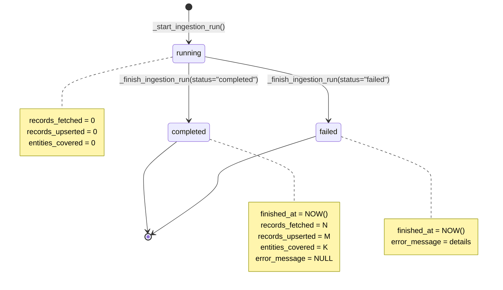
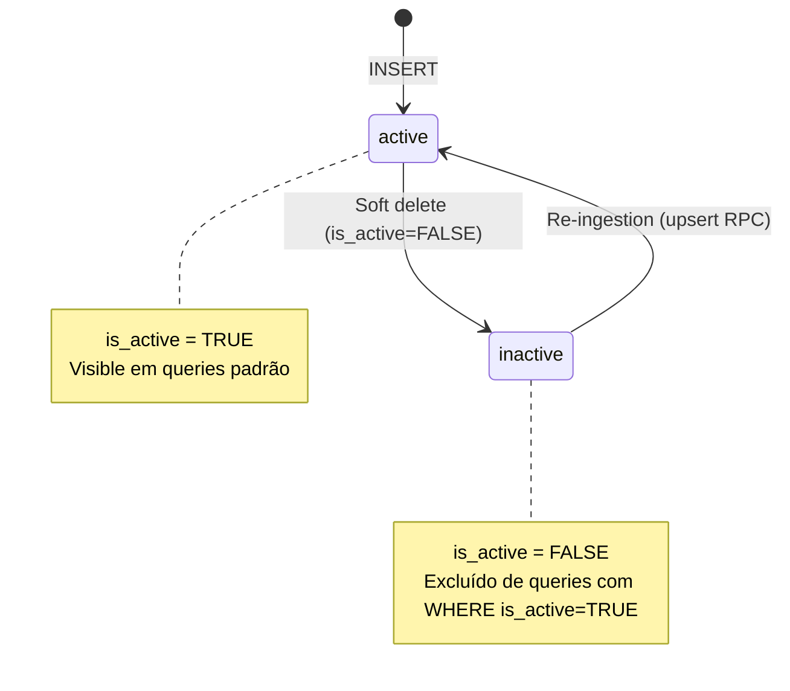
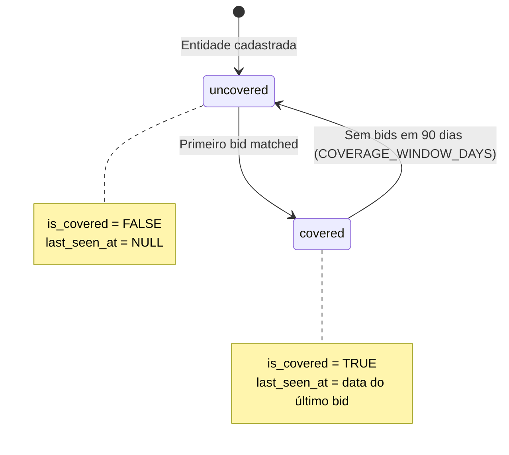
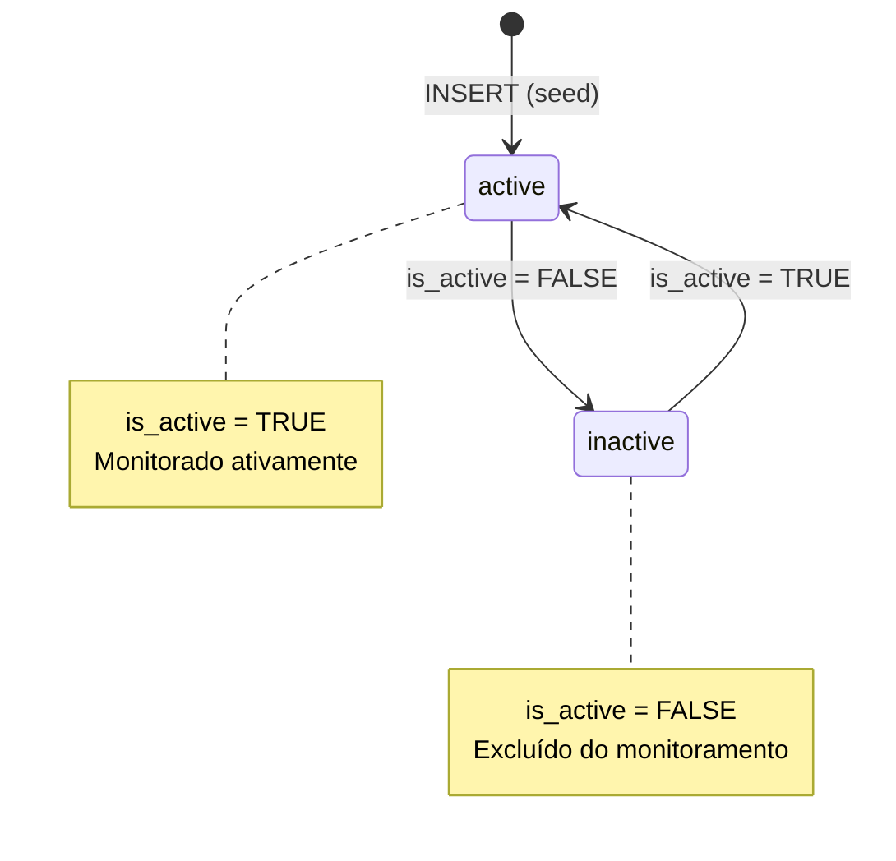
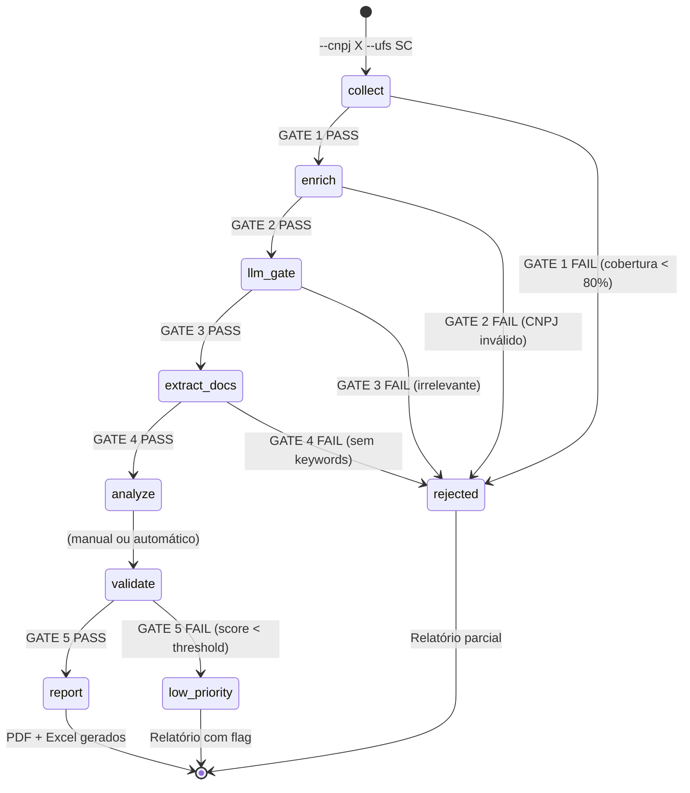

# Máquinas de Estado — Extra Consultoria

> Gerado pelo Detective em 2026-07-11T14:00:00Z
> doc_level: completo

---

## 1. Ingestion Run (entity: `ingestion_runs`)

🟢 **CONFIRMADO** — `monitor.py:94-117`

**Valores de status:** `running`, `completed`, `failed`

**Gatilhos de transição:**
- `running` → `completed`: Crawl termina sem exceção
- `running` → `failed`: Exceção capturada ou crawler não encontrado

---

## 2. Licitação (entity: `pncp_raw_bids`)

🟢 **CONFIRMADO** — `db/migrations/001:30`

**Valores de `is_active`:** `TRUE`, `FALSE`

**Gatilhos de transição:**
- INSERT → `active` automaticamente (DEFAULT TRUE)
- `active` → `inactive`: Via soft delete (não implementado em código Python, apenas schema)
- `inactive` → `active`: Re-ingestion via upsert RPC

---

## 3. Entity Coverage (entity: `entity_coverage`)

🟡 **INFERIDO** — `db/migrations/009`

**Valores de `is_covered`:** `TRUE`, `FALSE`

**Gatilhos de transição:**
- Cadastro → `uncovered`: Entidade inserida em `sc_public_entities`
- `uncovered` → `covered`: Primeiro bid matched com sucesso (trigger após upsert)
- `covered` → `uncovered`: Nenhum bid matched nos últimos 90 dias (query de coverage report)

---

## 4. Órgão Público (entity: `sc_public_entities`)

🟢 **CONFIRMADO** — `db/migrations/007`

**Valores de `is_active`:** `TRUE`, `FALSE`

**Gatilhos de transição:**
- INSERT → `active` (seed script popula com `is_active=TRUE`)
- `active` ↔ `inactive`: Atualização manual (não há automação)

---

## 5. Pipeline Intel (entity lógica: execução do pipeline)

🟡 **INFERIDO** — `intel_pipeline.py`

**Valores de status (por stage):** `PASS`, `FAIL`, `WARN`

**Gatilhos de transição:**
- Stage N → Stage N+1: Gate N retorna PASS
- Stage N → rejected/low_priority: Gate N retorna FAIL ou score abaixo do threshold
