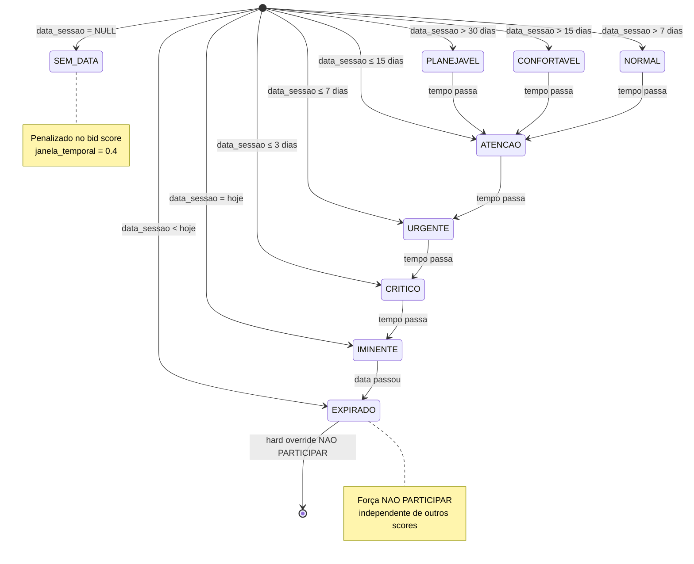
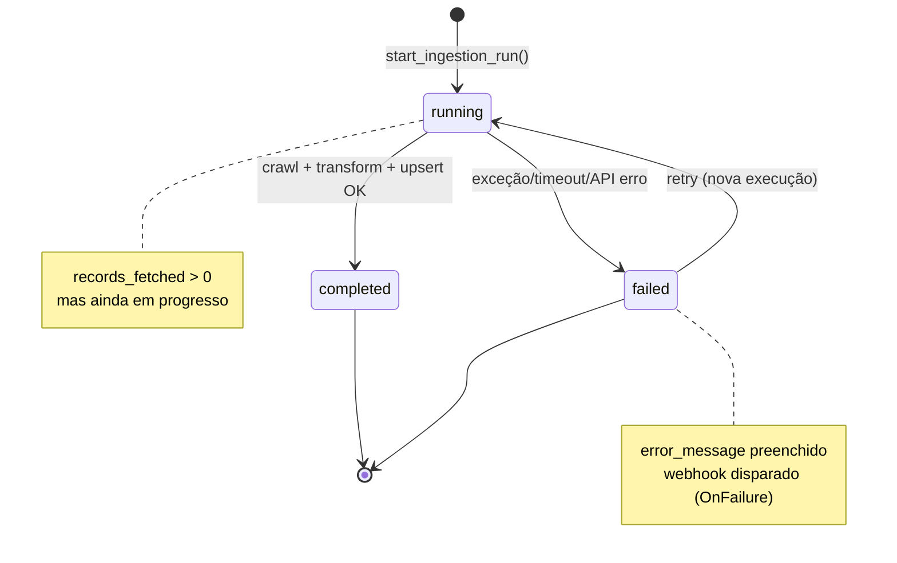
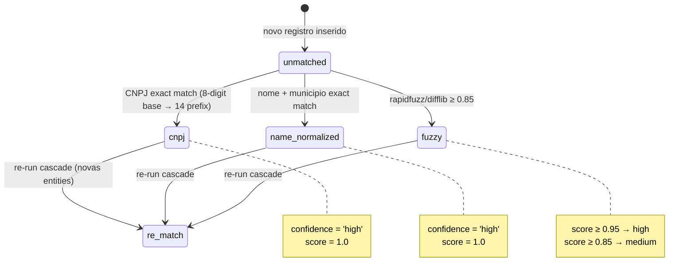
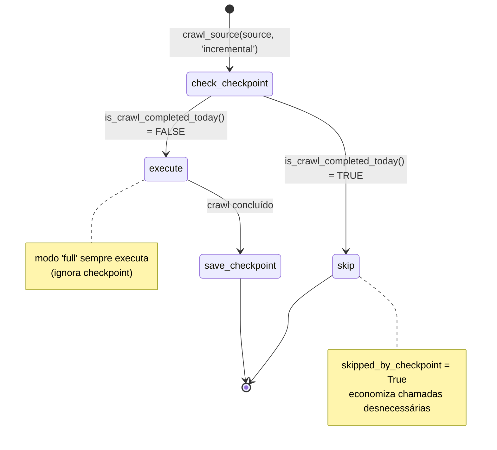
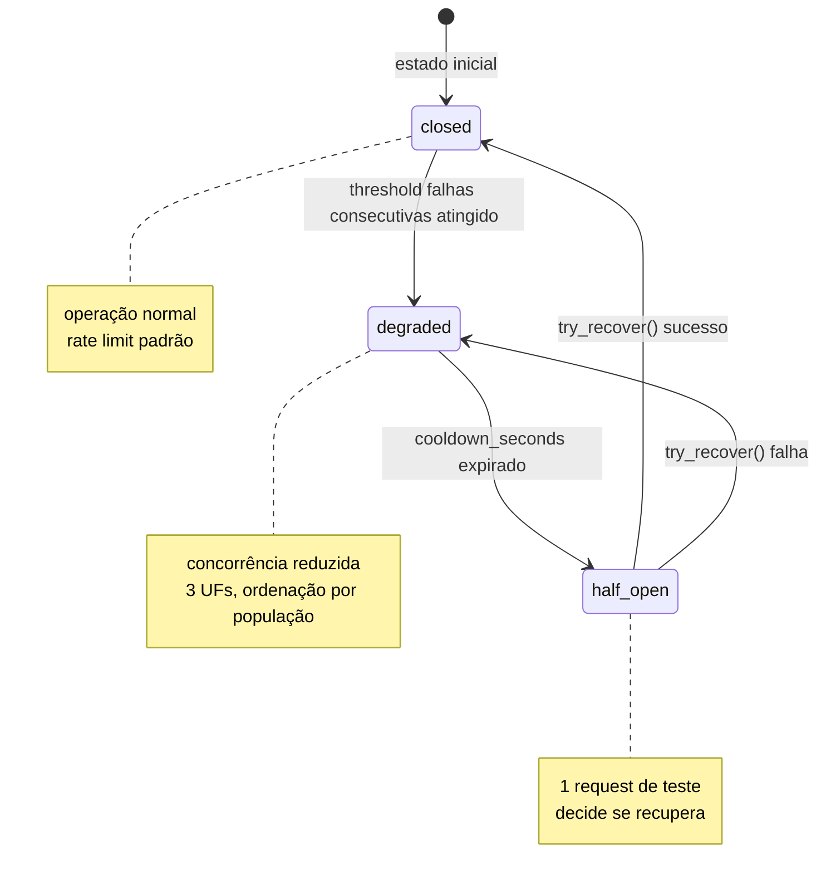
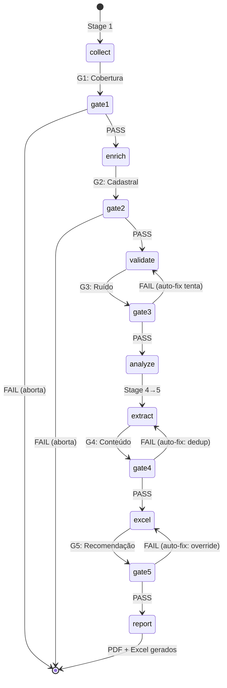
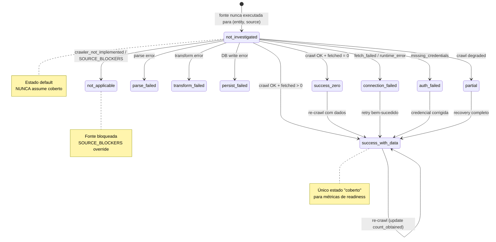
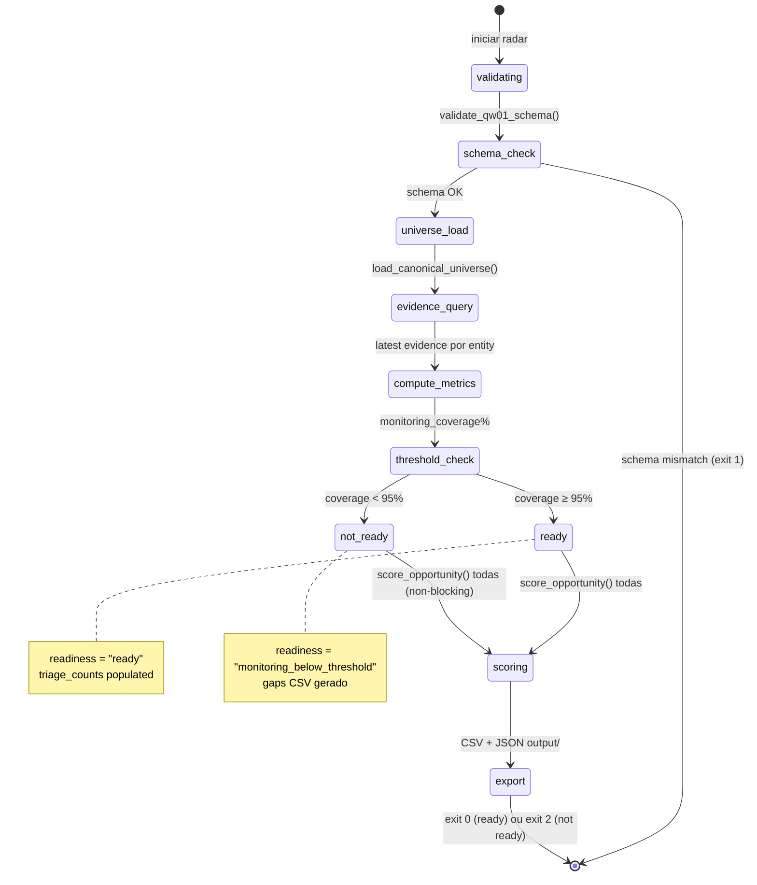
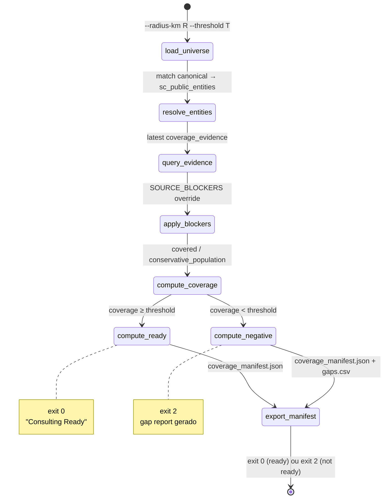

# Máquinas de Estado — Extra Consultoria

> Gerado pelo Detective em 2026-07-13T17:00:00Z
> doc_level: completo
> Base: commit 249340d
> Adições: MS7 (evidence_state), MS8 (QW-01 Radar), MS9 (Readiness Gate), MS10 (Freshness Gate)

---

## MS1: Status Temporal do Edital

**Entidade:** Edital (pipeline Intel) | **Campo:** `status_temporal`



🟢 CONFIRMADO — `intel-analyze.py:_compute_urgency()`, `intel_pipeline.py:gate5_recomendacao()`.

**Transições e gatilhos:**

| De | Para | Gatilho | Efeito no Score |
|----|------|---------|-----------------|
| Qualquer | EXPIRADO | `data_sessao < hoje` | Força NAO PARTICIPAR |
| Qualquer | IMINENTE | `data_sessao = hoje` | janela_temporal = 0.6 |
| Qualquer | CRITICO | `dias_restantes ≤ 3` | janela_temporal = 0.3 |
| Qualquer | URGENTE | `dias_restantes ≤ 7` | janela_temporal = 0.3 |
| Qualquer | ATENCAO | `dias_restantes ≤ 15` | janela_temporal = 0.5 |
| Qualquer | NORMAL | `dias_restantes ≤ 30` | janela_temporal = 0.8 |
| Qualquer | CONFORTAVEL | `dias_restantes > 30` | janela_temporal = 1.0 |
| Qualquer | PLANEJAVEL | `dias_restantes > 30` | janela_temporal = 1.0 |
| — | SEM_DATA | `data_sessao IS NULL` | janela_temporal = 0.4 |

---

## MS2: Status de Execução de Crawl (Ingestion Run)

**Entidade:** `ingestion_runs` | **Campo:** `status`



🟢 CONFIRMADO — `orchestrator.py:_start_ingestion_run()`, `_finish_ingestion_run()`.

---

## MS3: Estado de Match de Entidade

**Entidade:** `pncp_raw_bids` | **Campo:** `match_method`



🟢 CONFIRMADO — `entity_matcher.py:match_entities_cascade()`.

**Estados possíveis de `match_confidence`:** `high`, `medium`, `low` (declarado mas nunca atribuído — fuzzy com score ≥ 0.85 e < 0.95 vai para `medium`, < 0.85 não faz match).

---

## MS4: Estado de Ingestão (Checkpoint)

**Entidade:** Crawler execution | **Lógica:** checkpoint TD-5.2



🟢 CONFIRMADO — `orchestrator.py:crawl_source()`.

---

## MS5: Circuit Breaker (Rate Limiting)

**Entidade:** API externa | **Classe:** `PNCPCircuitBreaker`



🟢 CONFIRMADO — `circuit_breaker.py:PNCPCircuitBreaker`.

---

## MS6: Pipeline de Análise (Intel)

**Entidade:** Execução do pipeline | **Campo:** gate status



🟢 CONFIRMADO — `intel_pipeline.py:main()`.

---

## MS7: Estado de Evidência de Cobertura (Evidence Ledger)

**Entidade:** `coverage_evidence` | **Campo:** `evidence_state` (enum)



🟢 CONFIRMADO — `supabase/migrations/006-v3-unified-schema.sql:391` (enum definition), `scripts/crawl/monitor.py:_map_evidence_state()`.

**Mapeamento determinístico:** `monitor_status + error_code → evidence_state`:

| monitor_status | error_code | fetched | evidence_state |
|---------------|------------|---------|---------------|
| success | — | > 0 | `success_with_data` |
| success | — | = 0 | `success_zero` |
| degraded | — | any | `partial` |
| failed | — | any | `connection_failed` |
| empty | — | any | `success_zero` |
| skipped | — | any | `not_investigated` |
| — | crawler_not_implemented | — | `not_applicable` |
| — | missing_credentials | — | `auth_failed` |
| — | fetch_failed | — | `connection_failed` |
| — | persist_failed | — | `persist_failed` |
| — | runtime_error | — | `connection_failed` |

**Estados considerados "coberto" para readiness:** apenas `success_with_data` e `success_zero`.

---

## MS8: QW-01 Radar Execution

**Entidade:** `RadarExecution` | **Campo:** `exit_code`, `readiness`



🟢 CONFIRMADO — `scripts/opportunity_intel/radar.py:cmd_radar()`, `RadarExecution`, `MONITORING_THRESHOLD=95.0`.

**Exit codes:** 0 = pronto (coverage ≥ 95%), 2 = abaixo do threshold, 1 = falha técnica.

---

## MS9: Consulting Readiness Gate

**Entidade:** Execução do gate | **Lógica:** `consulting_readiness.py`



🟢 CONFIRMADO — `scripts/consulting_readiness.py:main()`. `DEFAULT_THRESHOLD=0.95`.

---

## MS10: Freshness Gate SLA

**Entidade:** `CriticalSourceSpec` | **Campo:** `freshness_sla_hours`

```mermaid
stateDiagram-v2
    [*] --> check_pncp: verificar PNCP (SLA 24h)
    [*] --> check_contracts: verificar Contracts (SLA 24d)

    check_pncp --> pncp_fresh: MAX(last_run_at) ≥ NOW() - 24h
    check_pncp --> pncp_stale: sem run recente

    check_contracts --> contracts_fresh: MAX(last_run_at) ≥ NOW() - 24d
    check_contracts --> contracts_stale: sem run recente

    pncp_fresh --> aggregate: ✓
    pncp_stale --> aggregate: ✗
    contracts_fresh --> aggregate: ✓
    contracts_stale --> aggregate: ✗

    aggregate --> all_fresh: todas fresh
    aggregate --> some_stale: ≥1 stale

    all_fresh --> [*]: exit 0
    some_stale --> [*]: exit 2

    note right of pncp_stale: SLA configurável:<br/>FRESHNESS_SLA_PNCP_HOURS
    note right of contracts_stale: SLA configurável:<br/>FRESHNESS_SLA_CONTRACTS_HOURS
```

🟢 CONFIRMADO — `scripts/freshness_gate.py:CRITICAL_SOURCES`, `main()`. SLAs configuráveis via env vars.
