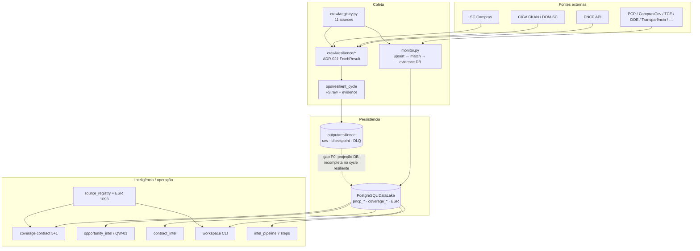

# System Architecture — Extra Consultoria

| Campo | Valor |
|-------|-------|
| **Versão** | **v3.0** |
| **Data** | **2026-07-17** |
| **Propósito** | Brownfield Discovery — Fase 1: refresh as-is do sistema |
| **Autor** | Aria (Visionary Architect) |
| **Predecessor** | v2.0 (2026-07-13/15) |
| **Escopo** | Código e artefatos no repositório em 2026-07-17 |
| **Companion (to-be)** | `docs/architecture/b2g-operational-target-architecture.md` |

---

## 1. Executive Summary

A Extra Consultoria é uma **plataforma CLI-first de inteligência B2G** (licitações públicas), single-client (Extra Construtora), operada pelo consultor Tiago Sasaki. Não é uma aplicação web multi-tenant: o produto é coleta multi-fonte + DataLake PostgreSQL + pipelines de inteligência + workspace operacional CLI.

### O que funciona hoje (as-is honesto)

| Capacidade | Estado factual |
|------------|----------------|
| Universo canônico 200 km SC | **1.093** entidades (`config/target_entities_200km.csv` + ESR) |
| Entity Source Registry (ESR) | **1.093/1.093** linhas em `data/entity_source_registry.jsonl` — *source mapping* 100% |
| Sinal comercial recente | **116/1.093 (10,61%)** — *não é cobertura operacional* |
| Cobertura operacional estrita (M2) | **0/1.093 (0%)** — collected/verified; dry-run/local_hit **não contam** |
| Fontes no registry de crawl | **11** (`scripts/crawl/registry.py`) |
| Resiliência local (PNCP, CIGA/DOM público, SC Compras) | **`NOT_READY`** para `PRE_VPS_FINAL_READY` — selo `LOCAL_RESILIENCE_READY` destruído; ver PRE-VPS-FINAL-TRUTH |
| Runtime VPS / timers em produção | **Não provisionado / não habilitado** |
| Stories P0 1.1–1.5 | **Done** (segurança, schema unificado, universe authority, reconcile open tenders, coverage model) |

### Posição pré-VPS (2026-07-17)

- README e `PRE-VPS-READINESS.md` declaram **`NOT_READY`**: o selo `LOCAL_RESILIENCE_READY` foi destruído.
- Truth gate unifica pipeline + PostgreSQL live, isola fixture, e exige canary real antes de `PRE_VPS_FINAL_READY`.
- Provedor de nuvem **ainda não definido** (ADR-007).

### Escala medida (repo)

| Métrica | Valor medido 2026-07-17 |
|---------|-------------------------|
| Arquivos Python em `scripts/` | **270** |
| LOC Python em `scripts/` | **~141.706** |
| Arquivos `test_*.py` | **127** |
| Migrations SQL em `db/migrations/` | **59** (~9.086 LOC SQL) |
| Units systemd (`deploy/systemd/`) | **49** (services + timers) |
| Commits desde TD assessment 2026-07-13 | **131** |

---

## 2. Technology Stack

| Camada | Tecnologia | Versão / evidência | Justificativa |
|--------|-----------|-------------------|---------------|
| Linguagem | Python | **3.12** (`.python-version`, CI `PYTHON_VERSION`) | Crawling, dados, LLM |
| Database | PostgreSQL 16 + extensões | Imagem teste: `pgvector/pgvector:pg16` | DataLake; trgm/vetorial conforme migrations |
| HTTP | httpx / requests | `httpx>=0.28.1`, `requests>=2.32.0` | Crawl async/sync |
| DB driver | psycopg2 | `psycopg2>=2.9.9` (binary só dev/test) | SQL direto, sem ORM |
| LLM | OpenAI | `openai>=1.55.0` (modelo via env, tipicamente GPT-4.1-nano) | Classificação de editais |
| PDF | ReportLab | `>=4.5.1` | Relatórios estilo consultoria |
| Excel | openpyxl | `>=3.1.5` | Planilhas operacionais |
| CLI UX | rich | `>=13.0.0` | Tabelas/painéis |
| HTML | lxml + bs4 | `>=5.0.0` / `>=4.12.0` | Portais |
| Fuzzy match | rapidfuzz | `>=3.0.0` | Entity matching |
| Config | python-dotenv + PyYAML | `>=1.0.0` / `>=6.0` | 12-factor |
| Scheduler (alvo) | systemd timers | nativo Linux | Zero broker externo |
| Quality local | ruff + mypy + bandit | pre-commit + CI | Lint / types / security |
| CI | GitHub Actions | `.github/workflows/ci.yml` | lint → mypy → pytest → resilience → bandit → pip-audit |
| Test DB | Docker Compose | `pgvector/pgvector:pg16` porta 5433 | Integration tests |
| Deploy (alvo) | VPS Ubuntu 24.04 | scripts em `deploy/` | Provedor **TBD** (ADR-007) |
| Opcional | Selenium / Playwright | comentados em `requirements.txt` | Portais JS / SICAF |

**Não é stack Next.js/React** apesar do preset AIOX genérico; o runtime de produto é Python CLI + PostgreSQL.

---

## 3. Project Structure (as-is)

```
extra-consultoria/
├── config/                         # Settings, YAML de domínio, perfil cliente
│   ├── settings.py                 # ~47 getenv / 12-factor
│   ├── coverage_slas.yaml          # SLAs do coverage contract
│   ├── source_applicability.yaml
│   ├── target_entities_200km.csv   # Universo 1093
│   ├── sectors_config.yaml / sectors_data.yaml
│   ├── client_profiles/extra.yaml  # Lei comercial (ADR-022)
│   └── mides-bigquery-sa.json      # ⚠ presente no tree (risco — ver TD-029)
│
├── scripts/                        # ~270 .py / ~142k LOC
│   ├── crawl/                      # Coleta multi-source + resilience ADR-021
│   │   ├── monitor.py              # Orquestrador legado→produção DB (~1581 LOC)
│   │   ├── registry.py             # 11 fontes SourceInfo
│   │   ├── resilience/             # adapters, pipeline, checkpoint, CB, HTTP policy
│   │   ├── ingestion/              # Contrato base CrawlerResult / loader
│   │   ├── *crawler*.py            # PNCP, DOM-SC, PCP, SC Compras, etc.
│   │   └── clients/                # HTTP clients (PNCP async, base)
│   ├── source_registry/            # ESR builder, discovery, gap, acquisition
│   ├── coverage/                   # Coverage contract 5+1 métricas
│   ├── workspace/                  # Facade operacional CLI (ADR-017)
│   ├── opportunity_intel/          # QW-01 radar + scoring + CLI
│   ├── contract_intel/             # Truth V1 queries
│   ├── buyer_intel/                # Ranking de compradores
│   ├── matching/                   # Entity matcher unificado (TD-027)
│   ├── ops/                        # health, resilient_cycle, schema_audit
│   ├── reports/                    # Panorama, executive, commercial session
│   ├── pipeline/                   # Backfill multi-source
│   ├── fix/                        # Repair / backfill utilitários
│   ├── lib/                        # Universe, geocode, normalizer, etc.
│   ├── schema/                     # Official acts, diagnostics SQL
│   ├── extra_ledger/               # Ledger operacional local
│   ├── ingestion/                  # (top-level) load official acts session
│   ├── intel_*.py                  # Intel-Busca pipeline (7 steps)
│   ├── local_datalake.py           # CLI datalake
│   └── golden_path.py / ci_gate.sh # Gates de validação
│
├── tests/                          # 127 test_*.py
│   ├── unit/ coverage/ source_registry/ workspace/
│   ├── integration/ smoke/ chaos/ fixtures/
│
├── db/
│   ├── migrations/                 # 001…054 (+a/b splits) — 59 SQL
│   ├── seed/ rollback/ snapshots/
│   └── setup_db.sh
│
├── supabase/migrations/            # 6 SQL + ARCHIVED — legado v2 (não SoT atual)
├── deploy/
│   ├── systemd/                    # 49 units
│   ├── install.sh / provision-vps.sh
│   └── hardening/
│
├── data/                           # Cache, ESR jsonl, checkpoints (parcial git)
├── output/                         # Artefatos gerados (gitignored operacional)
├── docs/architecture/              # Este doc + ADRs 007–022 + coverage-contract
├── docs/operations/                # PRE-VPS-*, resilience runbooks
├── .github/workflows/ci.yml
├── Makefile                        # golden-path, resilient-*, pre-vps-*, lint, test
├── docker-compose.yml
├── requirements.txt / pyproject.toml / pytest.ini
└── README.md
```

### LOC aproximado por subsistema (`scripts/`)

| Subsistema | Arquivos .py | LOC |
|------------|-------------|-----|
| crawl (+ resilience) | 107 | ~41.8k |
| Top-level scripts (intel_*, gates, etc.) | — | ~52.9k (maxdepth 1) |
| coverage | 16 | ~8.4k |
| reports | 12 | ~7.9k |
| opportunity_intel | 18 | ~6.9k |
| fix | 7 | ~4.2k |
| lib | 19 | ~4.1k |
| workspace | 6 | ~2.7k |
| matching | 4 | ~2.7k |
| source_registry | 12 | ~2.6k |
| schema | 3 | ~1.8k |
| contract_intel | 3 | ~1.7k |
| ops | 6 | ~0.9k |
| pipeline | 2 | ~0.9k |
| buyer_intel / extra_ledger | 3 | ~1.2k |

---

## 4. Component Architecture (C4-ish)

### 4.1 Visão de containers



### 4.2 Subsistema Crawl

**Registry:** `scripts/crawl/registry.py` — 11 fontes:

| Fonte | Módulo | Propósito | SLA freshness (registry) |
|-------|--------|-----------|--------------------------|
| pncp | `pncp_crawler_adapter` | bids | 4 h |
| dom_sc | `dom_sc_crawler` | bids | 24 h |
| pcp | `pcp_crawler` | bids | 24 h |
| compras_gov | `compras_gov_crawler` | bids | 12 h |
| sc_compras | `sc_compras_crawler` | bids | 24 h |
| contracts | `contracts_crawler` | contracts | 24 h |
| transparencia | `transparencia_crawler` | bids | 48 h |
| tce_sc | `tce_sc_crawler` | bids | 24 h |
| doe_sc | `doe_sc_crawler` | bids | 24 h |
| ciga_ckan | `ciga_ckan_crawler` | hybrid | 48 h |
| mides_bigquery | `mides_bigquery_crawler` | bids | 48 h (GCP SA; **PULADO** se sem conta) |

**Dois caminhos de coleta (tensão arquitetural atual):**

| Caminho | Entry | Persistência | Uso |
|---------|-------|--------------|-----|
| **A — monitor** | `scripts/crawl/monitor.py` | PostgreSQL (upsert, match, opportunities, `coverage_evidence`) | Units `pncp-crawl-*.service`, maioria legada |
| **B — resilient** | `python -m scripts.ops.resilient_cycle` | Filesystem (`RESILIENCE_*_PATH`) + migration 054 projeta campos | Units `extra-crawl-pncp/sc-compras/ciga-dom`; gates `make resilient-*` |

Caminho B implementa contrato ADR-021 (`FetchResult`: success / empty_confirmed / partial / rate_limited / auth_blocked / error) para **PNCP, CIGA/DOM público, SC Compras**. Demais fontes permanecem no caminho A/legado e **não contam** para “operational source coverage” estrita até migrarem.

**Entity matching:** unificado em `scripts/matching/entity_matcher.py` (importado por `monitor.py` — **TD-027 RESOLVIDO**). Cascade CNPJ → nome normalizado → fuzzy.

### 4.3 B2G Operational Platform (camada nova desde v2)

Alvo documentado em `b2g-operational-target-architecture.md` (ADRs 017–022):

| Camada | Módulo | SoT |
|--------|--------|-----|
| Client profile law | `config/client_profiles/extra.yaml` | ADR-022 |
| Entity Source Registry | `scripts/source_registry/*` + `data/entity_source_registry.jsonl` + mig 053 | ADR-019 |
| Coverage contract | `scripts/coverage/coverage_contract.py` + `config/coverage_slas.yaml` | ADR-018 |
| Workspace facade | `scripts/workspace/` (`today`, opportunities, coverage) | ADR-017 |
| Raw / ops data | `output/` gitignored | ADR-020 |
| Adapters fail-closed | `scripts/crawl/resilience/` | ADR-021 |

**Métricas (proibição de conflação):** ver `docs/architecture/coverage-contract.md`.

| ID | Métrica | Kind | Alvo | Valor de sessão (evidência ops) |
|----|---------|------|------|----------------------------------|
| M1 | `entities_with_recent_commercial_signal` | commercial_signal | n/a | **116/1093** |
| M2 | `operational_source_coverage` | coverage | ≥95% | **0/1093** estrito |
| M3 | `source_mapping_coverage` | coverage | 100% | **1093/1093** |
| M4 | `freshness_coverage` | coverage | SLA | depende de evidence real |
| M5 | `opportunity_recall` | recall | benchmark | `NOT_READY` sem sample estratificado |
| +1 | `required_field_completeness` | completeness | — | por registro |

### 4.4 Opportunity Intelligence

- CLI: `python -m scripts.opportunity_intel.cli` (list / show / explain / coverage / source-health / update / export / radar)
- QW-01: `radar.py` — pipeline auditável PostgreSQL-first
- Scoring/ranking ligados ao **client profile** (não hardcode comercial)

### 4.5 Contract Intelligence

- CLI: `scripts/contract_intel/cli.py`
- Capacidades: historical_contracts, competitor_winners, expiring_contracts, manifesto
- Views Truth V1 (migrations 025–026+)

### 4.6 Intel-Busca Pipeline (sob demanda)

Entry: `scripts/intel_pipeline.py` — 7 steps + 5 gates (collect → enrich → LLM → extract docs → analyze manual → excel → PDF). Continua válido para dossiês pontuais por CNPJ/UF; **não** é o radar diário do workspace.

### 4.7 Gates / CI / Ops

| Gate | Como rodar | Papel |
|------|------------|-------|
| Golden path | `make golden-path` | DB + crawl amostral + freshness |
| Resilient smoke/cycle | `make resilient-smoke` / `resilient-local-cycle` | Mecânica ADR-021 offline |
| Resilience gate | `make resilience-gate` | Fail-closed pré-VPS |
| Health | `python -m scripts.ops.health` | Exit 0/1/2 |
| Pre-VPS offline/live | `make pre-vps-final-gate-offline` / `pre-vps-live-canary` | Truth gate |
| CI | GitHub Actions | ruff, mypy, pytest (subset + full), bandit, pip-audit, resilience job |

---

## 5. Integration Points

| API / serviço | Consumidor principal | Auth | Notas |
|---------------|---------------------|------|-------|
| PNCP Consulta / Arquivos | crawl adapters, opportunity_intel, intel_extract_docs | pública | SLA registry 4 h |
| DOM-SC / CIGA CKAN | dom_sc / ciga_ckan / resilience bridge | API key opcional | público CKAN validado no path resiliente |
| PCP v2 | `pcp_crawler` | pública | |
| ComprasGov v3 | `compras_gov_crawler` | pública | |
| SC Compras | `sc_compras_crawler` + resilient adapter | pública | bulk + páginas virtuais |
| BrasilAPI / IBGE | `enricher.py` | pública | cache local |
| OpenAI | intel_llm_gate, classificadores | API key | custo operacional |
| GCP BigQuery (MIDES) | `mides_bigquery_crawler` | SA JSON | **PULADO** sem conta |
| PostgreSQL | quase todos os CLIs | `LOCAL_DATALAKE_DSN` | SoT canônico de negócio |
| SMTP / Webhook | `notify.py` | env | alertas |
| Supabase client | legado residual | service role | não é runtime primário |

---

## 6. Data Flow

### 6.1 Coleta → DataLake (caminho monitor)

```
Fontes → crawler.crawl(mode)
      → transform (schema unificado)
      → upsert RPC / SQL (pncp_raw_bids | contracts | …)
      → entity_matcher cascade
      → coverage_evidence / entity_coverage
      → opportunity materialization (quando aplicável)
```

### 6.2 Coleta resiliente (caminho ADR-021)

```
FetchRequest → SourceAdapter.fetch → FetchResult
            → raw SHA-256 (output/resilience/raw)
            → normalize (sem rede)
            → checkpoint fsync
            → evidence ledger + watermark (só se satisfatório)
            → DLQ se erro
            ⇢ [gap] projeção PostgreSQL / match / M2 coverage ainda não é o fim do cycle oficial
```

### 6.3 Workspace / comercial

```
ESR + profile + DB/opportunities
    → workspace today / opportunities / coverage
    → labels humanos GO|NO-GO|WATCH (loop feedback)
    → reports / PDF / Excel session packs
```

---

## 7. Configuration & Environments

### 7.1 Ambientes

| Ambiente | DB | Scheduler | Notas |
|----------|----|-----------|-------|
| **Dev local** | Docker `test-db` ou Postgres local | manual / Makefile | Baseline atual do README |
| **Pré-VPS gates** | pipeline + PG live; fixture isolado | fail-closed | `NOT_READY` até canary |
| **VPS alvo** | Postgres 16 dedicado | systemd 49 units | **não live**; provedor TBD |

### 7.2 Config

- **Env:** `config/settings.py` (~47 variáveis `getenv`) — DSN, OpenAI, PNCP, DOM-SC, ingestion, coverage, alertas, backup, notify.
- **Resilience:** `RESILIENCE_*` (timeouts, retries, CB, paths) — ver PRE-VPS-READINESS.
- **YAML:** sectors, transparencia, abbreviations, coverage_slas, source_applicability, client profile.
- **Secrets:** `.env` gitignored; `.env.example` template. **Exceção de risco:** `config/mides-bigquery-sa.json` ainda no tree.

### 7.3 Dados operacionais fora do git (ADR-020)

Raw, checkpoints, DLQ, watermarks, dumps e evidence de sessão vivem sob `output/` / paths configuráveis — não versionar como verdade comercial.

---

## 8. Database Schema (visão arquitetural)

SoT de migrations: **`db/migrations/`** (001–054). `supabase/migrations/` está **arquivado/legado** (não usar como linha do tempo atual).

### Famílias de schema

| Faixa | Tema |
|-------|------|
| 001–020 | Core bids/contracts, entities, RPCs, indexes, TTL, soft-delete |
| 021–026 | Hierarchy, evidence ledger, contract intel views / Truth V1 |
| 027–029 | Opportunity intel + QW-01 radar |
| 030–036 | Schema contract, snapshots, capability coverage, supplier identity, reporting |
| 037–044 | Target universe snapshot, FK fixes, aliases, upsert dedup |
| 045–049 | DLQ, watermarks, pipeline runs, hashes, PNCP resumable backfill |
| 050–054 | Contracts FK, date semantics, **official_acts**, **entity_source_registry**, **local_resilience_contract** |

### Tabelas / conceitos centrais

- `pncp_raw_bids`, `pncp_supplier_contracts` — fatos de coleta
- `sc_public_entities` + target universe views — catálogo / 200 km
- `entity_coverage`, `coverage_evidence` — cobertura e prova
- `opportunity_intel`, `radar_runs` — radar auditável
- `official_acts` (052) — atos oficiais multi-fonte
- ESR (053) — aplicabilidade fonte×ente
- 054 — campos/constraints de completude fail-closed para resiliência

Detalhamento DDL: responsabilidade de @data-engineer (Fase 2 Brownfield / `schema-v3.md` + migrations).

---

## 9. Testing & Quality Gates

### 9.1 Suite

| Categoria | Local | Observação |
|-----------|-------|------------|
| Unit | `tests/unit/**`, raiz `tests/test_*.py` | coverage, registry, workspace, crawlers |
| Integration | `tests/integration/`, markers DB | requer Postgres quando `REQUIRE_TEST_DB` |
| Smoke | `tests/smoke/` (3) | QW-01, contract intel, sources |
| Chaos | `tests/chaos/` (10) | 429, 500, reset, JSON inválido, duplicatas |
| Resilience | `tests/test_local_resilience.py`, `test_resilience_vertical_slice.py` | path ADR-021 |

**Coverage gate CI:** `--cov-fail-under=10` (baixo de propósito; dívida de rigor — ver TD-026).

### 9.2 CI (RESOLVIDO vs v2)

v2 listava “sem CI” (TD-028). **Agora existe** `.github/workflows/ci.yml` fail-closed:

1. ruff (`scripts/`)
2. mypy (fronteira crítica + resilience)
3. pytest readiness + coverage mínima
4. pytest full (quando configurado no job)
5. resilience gate
6. bandit `-lll`
7. pip-audit `--strict`

Pre-commit local: ruff format/check, mypy, bandit, detect secrets.

---

## 10. Deployment / VPS Readiness

### 10.1 Artefatos

- `deploy/install.sh`, `deploy/provision-vps.sh`
- `deploy/hardening/` (ufw, fail2ban, pg_hba)
- `deploy/systemd/*` — 49 units (crawl por fonte, coverage reports, backup, health, metrics, alerts, onfailure)
- `docs/ops/vps-provisioning.md`, `docs/operations/vps-go-live-checklist.md`

### 10.2 Matriz de prontidão (honesta)

| Claim | Status | Evidência |
|-------|--------|-----------|
| `LOCAL_RESILIENCE_READY` | **Destruído** | PRE-VPS-FINAL-ADVERSARIAL-AUDIT + TRUTH |
| `PRE_VPS_FINAL_READY` | **Não** | exige offline + canary live + CI |
| `LOCAL_READY` (produto consultivo full) | **Não** | M2 0/1093; freshness live não garantida |
| `VPS_OPERATIONAL` | **Não** | units não habilitadas; host não provisionado |
| Provedor cloud escolhido | **Não** | ADR-007 aberto |
| Dual runtime systemd resolvido | **Não** | audit F2 — `extra-crawl-*` vs `pncp-crawl-*` |
| Resilient cycle → PostgreSQL | **Não / parcial** | audit F1 — FS-first |

**Recomendação arquitetural:** não habilitar em VPS as units `extra-crawl-*` como “produção comercial” até o cycle resiliente projetar no DataLake (ou o monitor absorver o contrato ADR-021 end-to-end) e o health distinguir `controlled_fixture` de `live`.

---

## 11. Stories 1.1–1.5 e epics recentes

| Story | Tema | Status |
|-------|------|--------|
| **1.1** | Fix critical security / imports | **Done** |
| **1.2** | Unify schema + canonical views contract | **Done** |
| **1.3** | Universe authority (planilha → 1093) | **Done** |
| **1.4** | Reconcile open tenders / snapshots | **Done** |
| **1.5** | Coverage model multi-capability | **Done** |

**Epics/ondas 2026-07-13→17 (amostra de commits):** coverage 200 km operacional; B2G operational platform (ESR, coverage contract, workspace); official_acts + multi-source; LOCAL_RESILIENCE_READY; DoD stamps e charts executivos; adversarial audits de honestidade de métricas.

**Target epic B2G:** E1–E5 enablers (métricas, ESR, adapters, workspace, profile); E6–E13 analíticos sobre base estável — ver target architecture.

---

## 12. Débitos de sistema identificados

Legenda: **RESOLVED** desde v2 · **STILL OPEN** · **NEW** (pós-v2 / 2026-07-17).

### 12.1 Inventário

| ID | Débito | Sev. | Estado | Notas |
|----|--------|------|--------|-------|
| TD-001 | `bids_crawler.py` / dual path PNCP async legado | HIGH | **STILL OPEN** | Arquivo permanece; preferir adapter + resilience |
| TD-002 | DEFAULT_DSN duplicado settings vs CLIs | MED | **STILL OPEN** | Padrão residual em vários CLIs |
| TD-003 | Type hints / funções longas em monitor | MED | **STILL OPEN** | monitor ainda ~1581 LOC |
| TD-004 | Cache IBGE global mutável | MED | **STILL OPEN** | race potencial |
| TD-010 | `monitor.py` god-module | HIGH | **STILL OPEN** | Reduzido vs ~1756, ainda acoplado |
| TD-011 | Duas implementações PNCP | HIGH | **STILL OPEN** | adapter sync + bids_crawler + resilient adapter |
| TD-015 | Healthcheck unificado | MED | **PARCIAL** | `ops/health.py` existe; audit F3/F4: não distingue fixture/live nem SLA registry |
| TD-016 | SQL com f-strings | HIGH | **STILL OPEN** | risco residual — revalidar em Fase 2/QA |
| TD-017 | Scripts hyphen + underscore | MED | **STILL OPEN** | vários `*-*.py` no top-level |
| TD-018 | `backend/` duplica config | MED | **STILL OPEN** | `backend/sectors_data.yaml` etc. |
| TD-020 | Stubs ingestion transformer | LOW | **STILL OPEN** / mitigado | package `crawl/ingestion` evoluiu; stubs parciais |
| TD-025 | Sem ORM / SQL espalhado | MED | **STILL OPEN** | aceitável se parametrizado; dívida de abstração |
| TD-026 | Coverage threshold CI 10% | MED | **STILL OPEN** | gate existe mas frouxo |
| TD-027 | Matching duplicado monitor vs matcher | HIGH | **RESOLVED** | monitor importa `entity_matcher` |
| TD-028 | Sem CI/CD | HIGH | **RESOLVED** | GitHub Actions fail-closed |
| TD-029 | SA JSON no repo | HIGH | **STILL OPEN** | `config/mides-bigquery-sa.json` |
| TD-030 | Gaps de teste em schema/coverage | MED | **PARCIAL** | muito teste novo; gaps em contract_intel/buyer_intel |
| SYS-001 | Split-brain: resilient_cycle não grava PostgreSQL | **P0** | **NEW** | audit F1 |
| SYS-002 | Dual systemd runtimes (FS vs DB) | **P0** | **NEW** | audit F2 |
| SYS-003 | Health “healthy” após fixtures | **P0** | **NEW** | audit F3 |
| SYS-004 | Freshness SLA hardcoded ≠ registry | **P0** | **NEW** | audit F4 (pncp 24 vs 4) |
| SYS-005 | Checkpoint schema engolido (`TypeError: pass`) | **P0** | **NEW** | audit F5 |
| SYS-006 | CIGA salva checkpoint success no adapter | **P0** | **NEW** | audit F6 |
| SYS-007 | SC Compras bulk sem snapshot imutável | HIGH | **NEW** | audit F7 |
| SYS-008 | M2 operational coverage 0/1093 | HIGH | **NEW** (visível) | honestidade OK; gap de produto |
| SYS-009 | Provedor cloud / VPS não definido | MED | **STILL OPEN** | ADR-007 |
| SYS-010 | MIDES BigQuery sem conta | LOW | **STILL OPEN** | gotcha EPIC-COVERAGE |
| SYS-011 | TCE-SC e-Sfinge inviável sem ICP-Brasil | MED | **STILL OPEN** | gotcha |
| SYS-012 | DOM-SC API key / contrato CIGA | MED | **STILL OPEN** | gotcha |
| SYS-013 | Recall benchmark NOT_READY | MED | **STILL OPEN** | coverage contract |
| SYS-014 | Preset AIOX `nextjs-react` ≠ stack real | LOW | **STILL OPEN** | confusão de agentes |
| SYS-015 | Operational data accidental no git | MED | **STILL OPEN** | ADR-020 disciplina |

### 12.2 Contagem

| Classe | Qtd |
|--------|-----|
| RESOLVED (desde v2, confirmados) | **2** principais (TD-027, TD-028) + vários P0 de stories 1.x |
| PARCIAL | **2** (TD-015, TD-030) |
| STILL OPEN (legado v2 relevante) | **~12** |
| NEW (SYS-001…015 foco 2026-07-17) | **15** IDs (7 P0/HIGH de audit + gaps de produto/ops) |
| **Inventário ativo rastreado nesta seção** | **~28 itens** (não re-lista todos os LOW cosméticos de v2) |

### 12.3 Top recomendações (Architect)

1. **Fechar SYS-001/002** — um único runtime de coleta “oficial”: resilient contract **com** projeção DB (ou monitor consumindo `FetchResult` end-to-end). Sem isso, VPS = falso verde.
2. **Fechar SYS-003/004** — health com `mode`/`environment`, SLA lido do registry, last_success ≠ attempted_at.
3. **SYS-005/006/007** — checkpoint tipado fail-closed; adapter não marca success operacional; snapshot hash no bulk SC.
4. **TD-029** — remover SA do tree; secret store / env only.
5. **SYS-008** — só após 1–3: pipeline que eleve M2 com evidence real (meta 95% é alvo, não claim atual).
6. **TD-010/011** — reduzir dualidade PNCP e fatiar monitor após unificação do runtime.

---

## 13. Security Observations

| Item | Severidade | Estado |
|------|------------|--------|
| Secrets em `.env` | OK | 12-factor |
| SQL injection teórico (f-strings) | ALTO | TD-016 open |
| SA GCP no repositório | ALTO | TD-029 open |
| Single-user SSH / sem app auth | INFO | adequado à fase |
| Raw com headers sensíveis | MITIGADO | resilience strip + ADR-020 |
| Bandit + pip-audit no CI | OK | fail-closed |
| Superfície web multi-tenant | N/A | fora de escopo |

---

## 14. Padrões e anti-padrões

### Positivos

- Registry central de fontes + ESR por ente
- Coverage contract multi-métrica (anti-greenwashing)
- Fail-closed FetchResult (ADR-021) nas 3 fontes prioritárias
- Matching unificado (TD-027)
- CI fail-closed (TD-028)
- Universe 1093 como denominador fixo
- Workspace como facade (não espalhar SQL no consultor)
- Chaos tests + resilience gates

### Anti-padrões ativos

- Dois schedulers / duas verdades de persistência (SYS-001/002)
- Health que confunde fixture com live (SYS-003)
- God-module `monitor.py` (TD-010)
- Duplicação PNCP (TD-011)
- Duplicação `backend/` (TD-018)
- Claim de “cobertura” sem qualificar M1 vs M2 (mitigado em docs; vigilância contínua)

---

## 15. Referências cruzadas

| Documento | Papel |
|-----------|-------|
| `docs/architecture/b2g-operational-target-architecture.md` | To-be operacional B2G |
| `docs/architecture/coverage-contract.md` | Contrato formal 5+1 |
| `docs/architecture/adr/ADR-017` … `022` | Decisões B2G |
| `docs/architecture/adr/ADR-007*` | Cloud host TBD |
| `docs/architecture/schema-v3.md` | Schema (histórico; validar vs mig 030+) |
| `docs/operations/PRE-VPS-READINESS.md` | Claim NOT_READY (selo antigo destruído) |
| `docs/operations/PRE-VPS-FINAL-TRUTH.md` | Veredito adversarial final |
| `docs/operations/PRE-VPS-FINAL-ADVERSARIAL-AUDIT.md` | Contra-provas P0 |
| `docs/operations/LOCAL-RESILIENCE-*.md` | Diagnóstico + runbook |
| `docs/ops/session-b2g-platform-2026-07-17/` | Evidência de sessão / DoD |
| `README.md` | Comandos canônicos |

---

## 16. Change log deste documento

| Versão | Data | Mudança |
|--------|------|---------|
| v2.0 | 2026-07-13/15 | Brownfield inicial: QW-01, Contract Intel, 30 TDs, claim VPS-centric |
| **v3.0** | **2026-07-17** | Refresh: 1093 universe, ESR, coverage contract, workspace, resilience path, CI real, métricas honestas (116 / 0 / 1093), dual runtime, SYS-00x, stories 1.1–1.5 Done, 59 migrations, 270 py / 127 tests |

---

> **Aria (Visionary Architect) — Brownfield Discovery Fase 1.**  
> As-is privilegiado sobre narrativa. Claims de cobertura e prontidão VPS devem citar M1/M2 e o audit adversarial.  
> **Próxima fase sugerida:** Fase 2 Database Schema Audit (@data-engineer) alinhada a migrations 030–054 + residual SYS-001.
